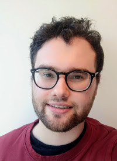

# Tom Decroos - PhD Researcher in Machine Learning, Artificial Intelligence, and Soccer Analytics

I am a 4th year PhD student in the DTAI Research group at KU Leuven working with Prof. [Jesse Davis (https://people.cs.kuleuven.be/~jesse.davis/). I research how to _learn_ from complex data streams (using both predictive and descriptive machine learning methods) with a focus on soccer analytics.

# Publications

### 2019
- Actions Speak Louder Than Goals: Valuing Player Actions in Soccer. _Tom Decroos, Lotte Bransen, Jan Van Haaren, Jesse Davis._ **KDD 2019 (Best Applied Data Science  Paper)**. [[paper](reports/kdd19_tomd.pdf)] [[slides](reports/kdd2019_tomd_slides.pdf)] [[youtube](https://www.youtube.com/watch?v=S_WJwqfVNis])]
- Player Vectors: Characterizing Soccer Players' Playing Style from Match Event Streams. _Tom Decroos, Jesse Davis._ **ECML/PKDD 2019**. [[paper](reports/ecml19_tomd.pdf)] [[slides](reports/playing-style-wide-v2.pdf)]
- Analyzing Soccer Players’ Skill Ratings Over Time Using Tensor-Based Methods. _Kenneth Verstraete, Tom Decroos, Bruno Coussement, Nick Vannieuwenhoven, Jesse Davis._ Machine Learning and Data Mining for Sports Analytics ECML/PKDD 2018 workshop.
[[paper](reports/mlsa19-verstraete.pdf)]

### 2018

- Automatic Discovery of Tactics in Spatio-Temporal Soccer Match Data. _Tom Decroos, Jan Van Haaren, Jesse Davis._ **KDD 2018**.
[[paper](https://lirias.kuleuven.be/retrieve/510838)] [[slides](reports/tactics-wide-v2.pdf)] [[slides pptx](reports/tactics-wide-v2.pptx)] [[poster](reports/tactics-poster.pdf)]

- AMIE: Automatic Monitoring of Indoor Exercises. _Tom Decroos, Kurt Schütte, Tim Op De Beéck, Benedicte Vanwanseele, Jesse Davis._ **ECML/PKDD 2018**.
[[paper](https://lirias.kuleuven.be/retrieve/514399)] [[slides](reports/amie-v3.pptx)] [[poster](reports/amie-poster.pdf)]

- Characterizing Soccer Players' Playing Style from Match Event Streams. _Aron Geerts, Tom Decroos, Jesse Davis._ Machine Learning and Data Mining for Sports Analytics ECML/PKDD 2018 workshop.
[[paper](https://lirias.kuleuven.be/retrieve/517045)] [[slides](reports/player-vectors-v2.pptx)]

- Actions Speak Louder Than Goals: Valuing Player Actions in Soccer. _Tom Decroos\*, Lotte Bransen\*, Jan Van Haaren, Jesse Davis_. Arxiv.
[[paper](https://arxiv.org/pdf/1802.07127.pdf)]

### 2017

- Predicting soccer highlights from spatio-temporal match event streams. _Tom Decroos, Vladimir Dzyuba, Jan Van Haaren, Jesse Davis._ **AAAI 2017**.
[[paper](https://lirias.kuleuven.be/retrieve/415729)] [[poster](reports/AAAI17poster.pdf)]

- STARSS: A spatio-temporal action rating system for soccer. _Tom Decroos, Jan Van Haaren, Vladimir Dzyuba, Jesse Davis._ Machine Learning and Data Mining for Sports Analytics ECML/PKDD 2017 workshop. [[paper](https://lirias.kuleuven.be/retrieve/465691)]
[[slides](reports/STARSS.pdf)] [[slides pptx](reports/STARSS.pptx)]

- Predicting the potential of professional soccer players. _Ruben Vroonen, Tom Decroos, Jan Van Haaren, Jesse Davis._ Machine Learning and Data Mining for Sports Analytics ECML/PKDD 2017 workshop. [[paper](https://lirias.kuleuven.be/retrieve/465703)]
[[slides](reports/APROPOS.pdf)] [[slides pptx](reports/APROPOS.pptx)]

You can also look at my [Lirias](https://lirias.kuleuven.be/cv?u=U0085417) or [google scholar](https://scholar.google.be/citations?user=qjT9xpQAAAAJ&hl=en).

# Internships
### Software Engineer (Machine Learning) at Facebook
PhD internship from June 2018 to August 2018 training and evaluating deep neural networks that recommend ads to over 2 billion users. I improved existing production models to (a) be more robust in A/A tests and (b) use less privacy-sensitive user data.

# Software
I am the author of two soccer-related pip packages:
- `socceraction` [[https://github.com/ML-KULeuven/socceraction](https://github.com/ML-KULeuven/socceraction)]: Convert soccer event stream data from commercial vendors (e.g., Opta, Wyscout, StatsBomb) to actions in the simpler SPADL language and value the actions using the VAEP framework.
- `matplotsoccer` [[https://github.com/TomDecroos/matplotsoccer](https://github.com/TomDecroos/matplotsoccer)]: Visualize soccer event stream data and common figures such as heatmaps over a soccer field.

# Awards
* AAAI-17 Student Travel Award by AAAI in December 2016.
* **Personal 4-year PhD scholarship** (aspirant) from FWO Flanders from October 2017 until September 2021.
* KDD-19 Student Travel Award by KDD in June 2019.
* **KDD-19 Best Paper in the Applied Data Science Track** (out of >700 submitted papers)

# Media
Our work on valuing actions in soccer appeared in numerous newspapers and media outlets:
- https://nieuws.kuleuven.be/en/content/2019/messi-v-ronaldo-whos-the-goat-new-computer-model-may-help-to-settle-the-debate
- https://sporza.be/nl/2019/08/20/belgisch-onderzoek-is-messi-beter-dan-ronaldo/
- https://www.mirror.co.uk/sport/football/news/supercomputer-determines-who-better-between-18969139
- https://www.dailystar.co.uk/sport/football/lionel-messi-vs-cristiano-ronaldo-18974258
- https://en.as.com/en/2019/08/21/football/1566373116_436669.html
- https://www.foxsportsasia.com/football/1160608/supercomputer-shows-who-is-better-between-cristiano-ronaldo-and-lionel-messi/
- https://innovationorigins.com/research-by-ku-leuven-brings-proof-messi-is-better-than-ronaldo/
- ...

# Community service

### Reviewing
- PC member for [SDM 2020](https://www.siam.org/conferences/cm/conference/sdm20)
- PC member for the [Machine Learning and Data Mining for Sports Analytics Workshop](https://dtai.cs.kuleuven.be/events/MLSA19) at [ECMLPKDD-19](http://ecmlpkdd2019.org/).
- Reviewer for [ECMLPKDD-2019](http://www.ecmlpkdd2019.org/) 
- Reviewer for [IEEE VIS-2019](http://ieeevis.org/year/2019/welcome)
- Subreviewer for [IJCAI-2019](https://ijcai19.org/)
- Reviewer for [AAAI-2019](https://aaai.org/Conferences/AAAI-19/)
- Reviewer for the [Big Data](https://home.liebertpub.com/publications/big-data/611/overview) Journal
- Reviewer for the [Machine Learning and Data Mining for Sports Analytics Workshop](https://dtai.cs.kuleuven.be/events/MLSA18) at [ECMLPKDD-18](http://ecmlpkdd2018.org/).
- Reviewer for the [Machine Learning and Data Mining for Sports Analytics Workshop](https://dtai.cs.kuleuven.be/events/MLSA17) at [ECMLPKDD-17](http://ecmlpkdd2019.org/).
- Subreviewer for [KDD-2017](http://www.kdd.org/kdd2017/).
- Subreviewer for [UAI-2017](http://auai.org/uai2017/index.php).

### Organizing
I co-organized a three day Spring workshop on mining and learning ([SMiLee](https://dtai.cs.kuleuven.be/smilee/)) for the ML group of KU Leuven in 2017.

# Didactical tasks
I am/was a teaching assistant for the following courses:
- Declarative languages (2019-2020)
- Data structures and algorithms (2019-2020)
- Declarative languages (2018-2019)
- Data structures and algorithms (2018-2019)
- Declarative languages (2017-2018)
- Data structures and algorithms (2017-2018)
- Mathematical reasoning for computer scientists (2016-2017)
- Data structures and algorithms (2016-2017)
    
I am/was a daily master's thesis advisor for the following students:
- Jasper Maes (2019-2020)
- Tomas Geens (2019-2020)
- James Defauw (2019-2020)
- Tim Hofmans (2018-2019)
- Nick Schouten (2018-2019)
- Kenneth Verstraete (2017-2018)
- Wouter Bruyninckx (2017-2018)
- Aron Geerts (2017-2018)
- Ruben Vroonen (2016-2017)

I am the ombuds for both the Dutch Master Computerwetenschappen and the English Master in Computer Science at KU Leuven. You can reach me at ombuds-master@cs.kuleuven.be.

# Contact
**Email**  
[Send an email](https://people.cs.kuleuven.be/cgi-bin/e-post.pl?epost=Tom.Decroos)  

**Phone**  
+32 16 37 47 59  

**Address**  
Department of Computer Science, KU Leuven  
Celestijnenlaan 200A box 2402  
3001 Heverlee, Belgium  

**Office**  
200A.02.144

You can also reach me via my [KU Leuven profile](https://www.kuleuven.be/wieiswie/en/person/00085417), [LinkedIn](https://www.linkedin.com/in/tom-decroos-97488980/) or [Twitter](https://twitter.com/TomDecroos).

_Last update: 23/10/2019_
